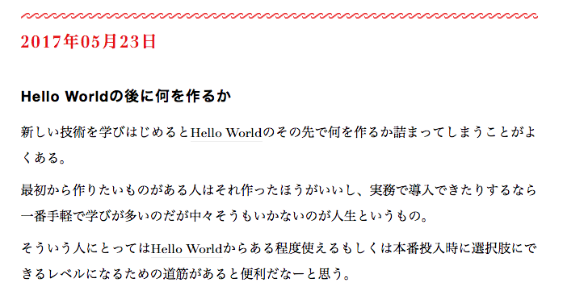

### Reactで
### ライフゲームを作ってみた話

### 0x64物語 REBOOT #11

@otakumesi

---

@otakumesi (@fa[twitter], @fa[github])  
マッハバイトでエンジニアしてます

---

### なぜライフゲームなのか

言語を学んだ後になにを作るかで悩んでいたときにある記事を読んだ

---

### こんな記事

http://razokulover.hateblo.jp/entry/2017/05/23/131359

---

### ブコメにこんなコメントが

---

# なるほど :thinking:

---

### ライフゲーム

* 「Conway's Game of Life」と呼ばれている
* 生命の誕生、進化、淘汰を簡単なモデルで再現したシミュレーションゲーム
* 単純なルールで状態が次々と変わっていく

---

---

### ライフゲームのルールは単純

* 誕生
* 生存
* 過疎
* 過密

https://ja.wikipedia.org/wiki/%E3%83%A9%E3%82%A4%E3%83%95%E3%82%B2%E3%83%BC%E3%83%A0

---

### ライフゲームは状態の変更が激しい

状態管理を簡単にするフレームワークを試すのによい

---

# 実際作ってみたデモ

http://otakumesi.io/lifegame/
https://github.com/otakumesi/lifegame

---

### 構成
とりあえず触りたい奴を詰め込んだ

- ES6
  - preset-env
  - preset-react
  - plugin-propsal-object-rest-spread
- React
- Redux
- PostCSS
- FLOCSS

---

### 実際に作ってみてどうよ
正直、いくつか反省している

* どう考えても今回の構成にReduxはいらなかった
  * 複雑な状態を管理をしていない...
  * モチベ的にはあまり触ってないものを触れたかったので、MobXあたりがよい落とし所だったか

---

### ライフゲーム作ってよかったところ

* 簡単に作れる割にハマりどころを通ってハマっていけた
  * おかげでReact、Reduxと少し仲良くなれた気がする...
* ライフゲームのついでに定形作業を把握できたので、自分用のボイラープレートを作れた

---

### ボイラープレート
さすがに毎度package集めて、  
webpackの設定をアレするのはつらい。

https://github.com/otakumesi/dotfiles/tree/master/.project.template/frontend

---

# おしまい
